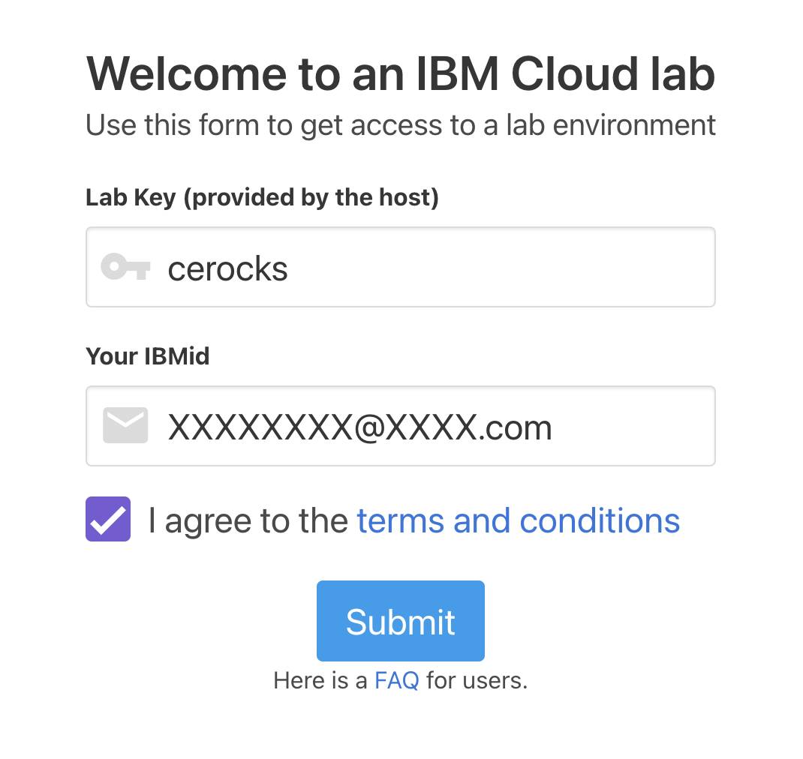
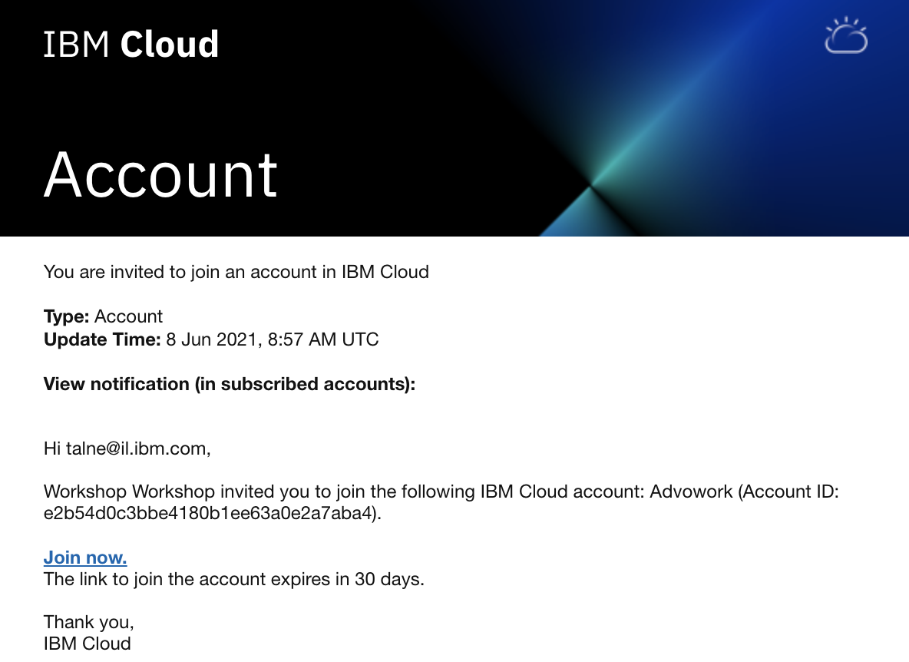
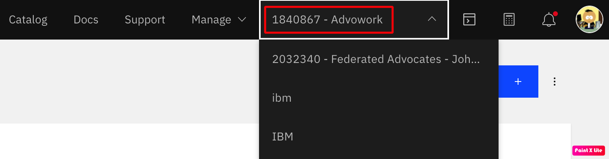

# Call for Code

https://developer.ibm.com/callforcode/

# Workshop

## Steps

1) Create IBM Cloud account
2) Get access to the workshop environment
3) Go to the tutorial on IBM Developer site

### Create IBM Cloud account

https://ibm.biz/BdfMG8 

### Get access to the workshop environment

Go to: https://code-engine-workshop.mybluemix.net

- Enter the "Lab Key": cerocks
- Enter your email (IBMid)
- Agree to the terms and conditions
- Click Submit

You will get email with invitation to account on IBM Cloud, click "Join now"

Log in to IBM Cloud, select the "1840867 - Advowork" account.

### Go to the tutorial on IBM Developer site

https://developer.ibm.com/tutorials/deploy-max-models-with-ibm-cloud-code-engine/#deploy-with-the-gui